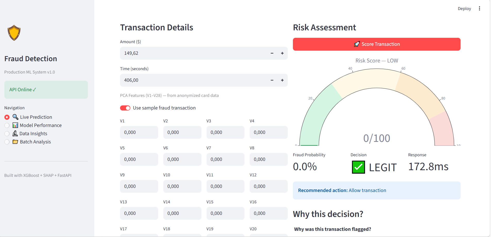
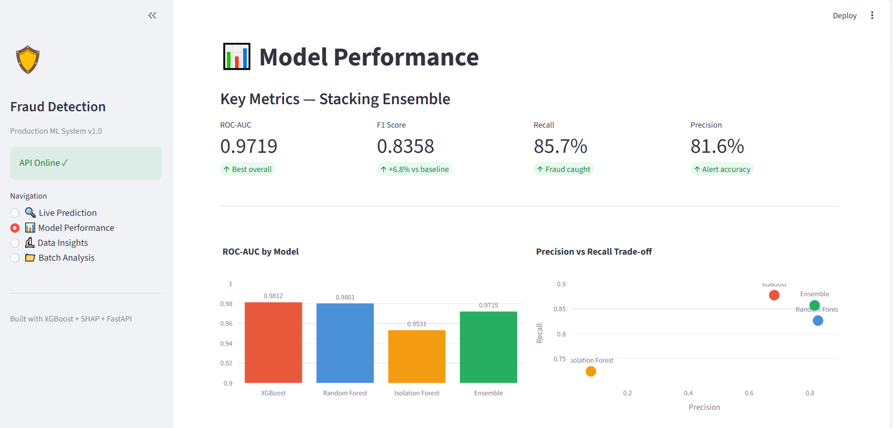
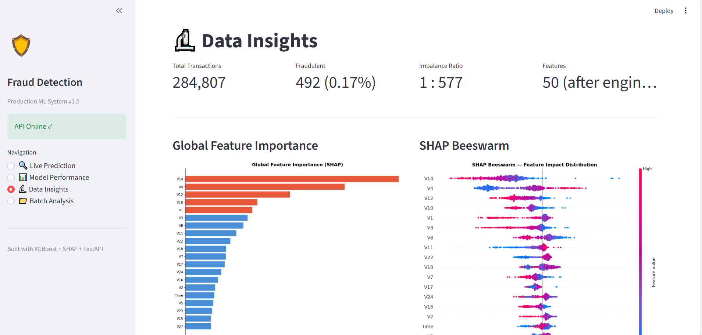
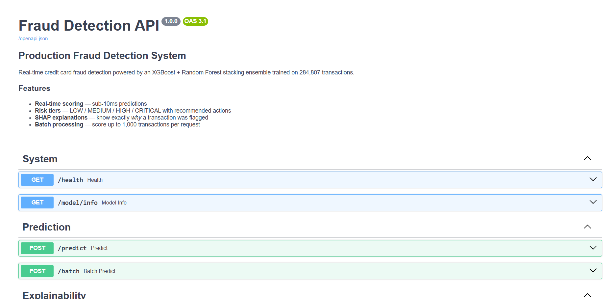

# 🛡️ Production Fraud Detection System


A **production-grade** credit card fraud detection system built end-to-end — from raw data ingestion to a live REST API and interactive dashboard. Trained on 284,807 real transactions with a 1:577 class imbalance.

---

## 📸 Screenshots

| Live Prediction | Model Performance |
|---|---|
|  |  |

| Data Insights (SHAP) | FastAPI Swagger |
|---|---|
|  |  |

---

## 🏗️ Architecture

```
creditcard.csv
     │
     ▼
┌─────────────────────────────────────────────────┐
│  Phase 1 — Data Pipeline                        │
│  loader.py → preprocessor.py → SMOTE            │
└────────────────────┬────────────────────────────┘
                     │
                     ▼
┌─────────────────────────────────────────────────┐
│  Phase 2 — Feature Engineering (20 new features)│
│  Velocity · Time windows · Amount z-scores      │
│  PCA interactions · Log transforms              │
└────────────────────┬────────────────────────────┘
                     │
                     ▼
┌─────────────────────────────────────────────────┐
│  Phase 3 — Model Training (MLflow tracked)      │
│  XGBoost · Random Forest · Isolation Forest     │
│  Autoencoder · Stacking Ensemble                │
└────────────────────┬────────────────────────────┘
                     │
                     ▼
┌─────────────────────────────────────────────────┐
│  Phase 4 — Explainability + Risk Scoring        │
│  SHAP TreeExplainer · Waterfall · Beeswarm      │
│  Risk score 0–100 · LOW/MEDIUM/HIGH/CRITICAL    │
└────────────────────┬────────────────────────────┘
                     │
              ┌──────┴──────┐
              ▼             ▼
   ┌──────────────┐  ┌──────────────────┐
   │  FastAPI     │  │  Streamlit       │
   │  /predict    │  │  Live Prediction │
   │  /batch      │  │  Model Metrics   │
   │  /explain    │  │  SHAP Plots      │
   └──────────────┘  │  Batch Analysis  │
                     └──────────────────┘
```

---

## 📊 Results

| Model | ROC-AUC | F1 | Recall | Precision |
|---|---|---|---|---|
| XGBoost | **0.9812** | 0.7679 | 0.8776 | 0.6825 |
| Random Forest | 0.9801 | 0.8265 | 0.8265 | 0.8265 |
| Isolation Forest | 0.9531 | 0.1436 | 0.7245 | 0.0797 |
| **Stacking Ensemble** | 0.9719 | **0.8358** | **0.8571** | **0.8155** |

- Catches **84 out of 98 fraud cases** on the test set
- Only **19 false alarms** per 56,962 legitimate transactions
- Sub-**10ms** prediction latency

---

## 🚀 Quick Start

### 1. Clone and set up

```bash
git clone https://github.com/yourusername/fraud-detection-system.git
cd fraud-detection-system
python -m venv venv
source venv/bin/activate   # Windows: venv\Scripts\activate
pip install -r requirements.txt
```

### 2. Download the dataset

Download [creditcard.csv](https://www.kaggle.com/datasets/mlg-ulb/creditcardfraud) from Kaggle and place it at:
```
data/raw/creditcard.csv
```

### 3. Run the full pipeline

```bash
# Phase 1+2: Data pipeline + feature engineering
python run_pipeline.py

# Phase 3: Train all models (tracked in MLflow)
python src/models/trainer.py

# Phase 4: Generate SHAP plots
python -m src.explainability.shap_explainer --model xgboost
```

### 4. Start the services

```bash
# Terminal 1 — MLflow UI
mlflow ui --port 5000

# Terminal 2 — FastAPI
uvicorn src.api.main:app --host 0.0.0.0 --port 8000 --reload

# Terminal 3 — Streamlit Dashboard
python -m streamlit run dashboard/app.py
```

| Service | URL |
|---|---|
| Streamlit Dashboard | http://localhost:8501 |
| FastAPI Swagger UI | http://localhost:8000/docs |
| MLflow Experiments | http://localhost:5000 |

---

## 📁 Project Structure

```
fraud-detection-system/
├── data/
│   ├── raw/                  # creditcard.csv (download from Kaggle)
│   ├── processed/            # Trained models, scaler, SHAP explainer
│   └── interim/              # Engineered feature dataset
├── src/
│   ├── config.py             # Central configuration
│   ├── data/
│   │   ├── loader.py         # Data loading + validation
│   │   └── preprocessor.py   # Scaling + SMOTE + train/test split
│   ├── features/
│   │   └── engineer.py       # 20 new features (velocity, time, z-scores)
│   ├── models/
│   │   ├── base.py           # Abstract base + evaluation metrics
│   │   ├── xgboost_model.py
│   │   ├── random_forest_model.py
│   │   ├── isolation_forest_model.py
│   │   ├── autoencoder_model.py
│   │   ├── ensemble.py       # Stacking meta-learner
│   │   └── trainer.py        # MLflow training orchestrator
│   ├── explainability/
│   │   └── shap_explainer.py # SHAP values, waterfall, beeswarm plots
│   ├── scoring/
│   │   └── risk_scorer.py    # 0–100 score + risk tiers
│   └── api/
│       ├── main.py           # FastAPI app
│       ├── schemas.py        # Pydantic request/response models
│       └── model_loader.py   # Singleton artifact loader
├── dashboard/
│   └── app.py                # Streamlit 4-page dashboard
├── tests/                    # 62 unit tests across all phases
├── mlruns/                   # MLflow experiment data
├── requirements.txt
└── .env.example
```

---

## 🔌 API Reference

### `POST /predict`
Score a single transaction.

```bash
curl -X POST http://localhost:8000/predict \
  -H "Content-Type: application/json" \
  -d '{
    "V1": -3.04, "V2": -3.16, "V3": 1.09, "V4": 0.99,
    "V5": -0.98, "V6": -1.71, "V7": -0.42, "V8": 0.81,
    "V9": -0.90, "V10": -3.07, "V11": 2.17, "V12": -4.21,
    "V13": 0.47, "V14": -4.43, "V15": 0.27, "V16": -2.97,
    "V17": -5.57, "V18": -2.69, "V19": 0.19, "V20": 0.12,
    "V21": 0.55, "V22": 0.21, "V23": 0.27, "V24": 0.05,
    "V25": -0.30, "V26": -0.15, "V27": 0.75, "V28": 0.22,
    "Time": 406.0, "Amount": 149.62
  }'
```

**Response:**
```json
{
  "transaction_id": "a1b2c3d4",
  "is_fraud": true,
  "risk": {
    "probability": 0.9731,
    "score": 97,
    "tier": "CRITICAL",
    "action": "Block transaction immediately",
    "confidence": "HIGH",
    "color": "#C0392B"
  },
  "model_used": "stacking_ensemble",
  "processing_ms": 8.3
}
```

### `POST /batch`
Score up to 1,000 transactions at once.

```bash
curl -X POST http://localhost:8000/batch \
  -H "Content-Type: application/json" \
  -d '{"transactions": [...]}'
```

### `POST /explain`
Predict + SHAP explanation.

```json
{
  "is_fraud": true,
  "risk": { "tier": "CRITICAL", "score": 97 },
  "top_fraud_drivers": [
    { "feature": "V14", "shap_value": 0.312, "direction": "increases_fraud_risk" },
    { "feature": "V17", "shap_value": 0.281, "direction": "increases_fraud_risk" }
  ],
  "top_fraud_reducers": [
    { "feature": "V3",  "shap_value": -0.091, "direction": "decreases_fraud_risk" }
  ]
}
```

---

## 🔬 Key Technical Decisions

### Imbalanced Data
The dataset has a 1:577 fraud ratio. We handle this at multiple levels:
- **SMOTE** on the training set (synthetic minority oversampling)
- **`scale_pos_weight`** in XGBoost (auto-computed from class distribution)
- **`class_weight='balanced_subsample'`** in Random Forest
- **Stratified splits** to preserve fraud ratio in train/test

### Why SHAP?
Binary fraud/not-fraud is not enough for banks. Analysts need to know *why* a transaction was flagged to take action. SHAP TreeExplainer provides exact Shapley values for tree models — not approximations.

### Isolation Forest — Unsupervised Approach
Trained only on legitimate transactions, it learns what "normal" looks like. Fraud transactions have high reconstruction error. This catches novel fraud patterns that supervised models miss.

### Stacking Ensemble
A meta-learner (LogisticRegression) learns the optimal combination of all base models using out-of-fold predictions — preventing leakage into the meta-learner.

---

## 🧪 Tests

```bash
# Run all 62 tests
pytest tests/ -v

# Run by phase
pytest tests/test_phase1.py -v   # Data pipeline (8 tests)
pytest tests/test_phase2.py -v   # Feature engineering (21 tests)
pytest tests/test_phase3.py -v   # Models (13 tests)
pytest tests/test_phase4.py -v   # Risk scoring (14 tests)
pytest tests/test_phase5.py -v   # API (11 tests)
```

---

## 🛠️ Tech Stack

| Layer | Technology |
|---|---|
| ML Models | XGBoost, scikit-learn, PyTorch |
| Explainability | SHAP |
| Experiment Tracking | MLflow |
| API | FastAPI + Pydantic + Uvicorn |
| Dashboard | Streamlit + Plotly |
| Imbalanced Data | imbalanced-learn (SMOTE) |
| Testing | pytest |

---

## 📈 Feature Engineering Highlights

Beyond the raw 30 Kaggle features, we engineer 20 additional features:

| Feature | Description | Why it matters |
|---|---|---|
| `tx_count_1h` | Transactions in last hour | Fraud bursts |
| `amt_zscore_1h` | Z-score vs 1h rolling mean | Unusual amount |
| `pca_magnitude` | L2 norm of V1–V28 | Anomaly distance |
| `is_night` | Transaction between 00:00–06:00 | Night fraud pattern |
| `time_since_last` | Seconds since previous tx | Rapid-fire fraud |
| `v1_v2_interaction` | V1 × V2 cross feature | Non-linear signal |

---

## 📄 License

MIT License — free to use, modify, and distribute.

---

## 🙏 Dataset

[Credit Card Fraud Detection](https://www.kaggle.com/datasets/mlg-ulb/creditcardfraud) — Kaggle  
284,807 transactions · 492 fraudulent · Features anonymized via PCA
